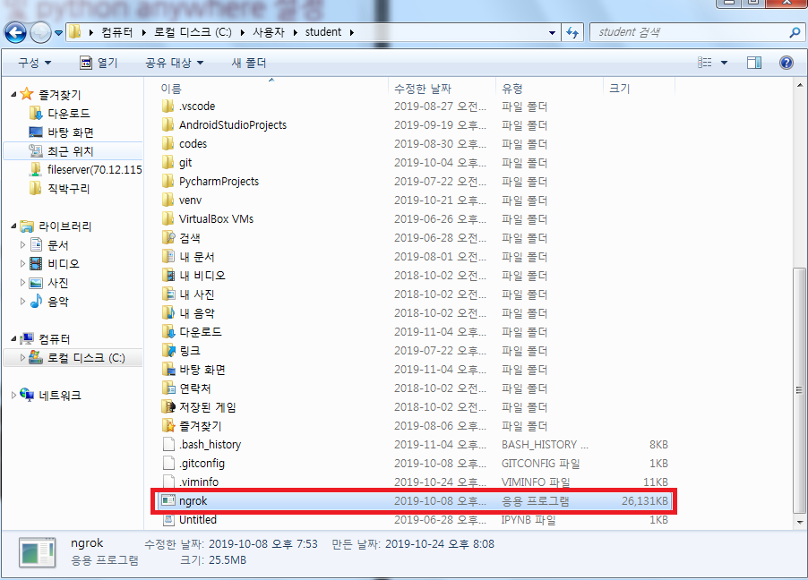
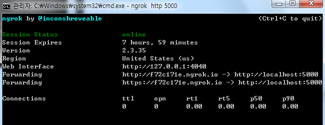
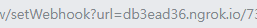
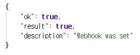
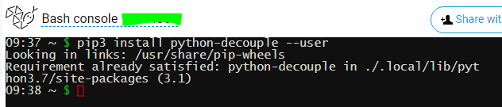
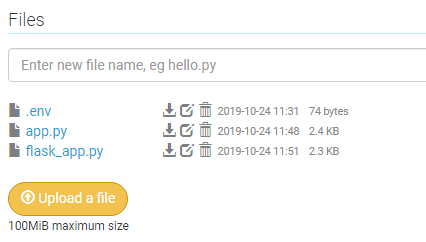
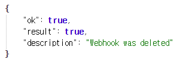
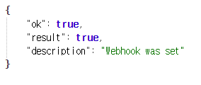
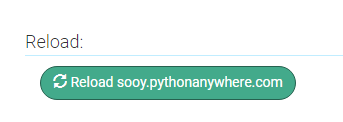

# 1. ngrok

### 1.1 ngrok 설치

- `C:\USERS\student` 경로에 넣어주기

  > 

<br>

<br>

### 1.2 ngrok 실행

```bash
# cmd

C:\Users\student> ngrok http 5000
```

<br>

- 서버가 실행된다

> 

<br>

<br>

### 1.3 WebHook 설정

- telegram bot이 ngrok 서버를 거치도록 설정

> https://api.telegram.org/bot[chat_id]:[token]/setWebhook?url=db3ead36.ngrok.io/[chat_id]:[token]

> 

<br>

- webhook 설정 완료

> 


<br>

<br>

### 1.4 ngrok 서버 배포

#### Python anywhere 

- 회원가입

- web

  - create > Flask > python -7 클릭

    > 

- Decouple 설치

  ```bash
  $ pip install python-decouple --user
  ```

  > 

<br>

- `flask_app`& `.env` 옮기기

  - 기존 `flask_app.py`와 `.env`를 복붙해준다

  > 

  

<br>

<br>

<br>

# Python Anywhere 서버로 변경

> 기존 ngrok 서버 url을 없애고 새로운 server url로 연결

<br>

### 1.1 ngrok으로 되어있는 기존 WebHook삭제

- ngrok 서버 url 삭제

  > https://api.telegram.org/bot[chat_id]:[token]/deleteWebhook 

  > 

<br>

- 기존 WebHook이 삭제되었다

  > 

<br>

<br>

### 1.2 Webhook 재설정

- python anywhere로 Webhook을 재설정해준다

  > 

  <br>

  ```
  https://api.telegram.org/bot[chat_id]:[token]/setWebhook?url=sooy.pythonanywhere.com/[chat_id]:[token]
  ```

  <br>

- Webhook이 재설정되었다

  > 

<br>

- 잘 도는지 확인

  > 

  

